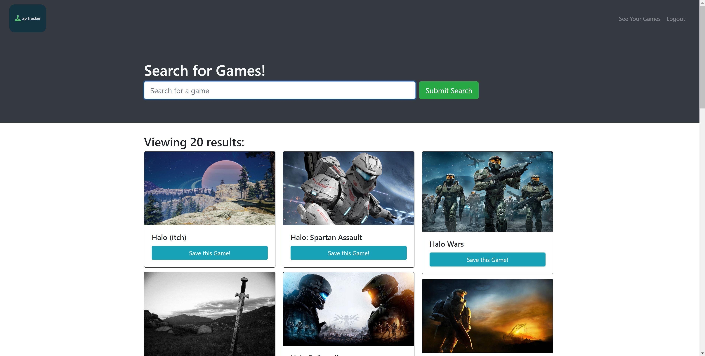

# Xp-Tracker

Are you knee deep in the Steam Summer Sale? Have a backlog of games you still need to play or even not sure what to spend your hard earned cash on?
You should try our app Xp-Tracker! Keep track of a huge database of games that have been reviewed by like minded individuals and add some of your favorites to your personal profile to keep up to date on planned video game binges.

## Description

Xp-Tracker is a MERN full stack app utilizing all MERN technologies such as Node, Express, React, MongooseDB as well as Graphql to provide easier querying for the apps clientele. Additional modules include Axios to assist with routing, Bootstrap and Material UI for styling, and JWT-Decode and Bcrypt for encryption.

# Deployment

Our App was deployed through [Heroku](https://afternoon-sands-31650.herokuapp.com/).

# Preview

    ```md
    

    ```

## Usage

Type the name of a video game in the search field, then press enter or click the `Submit Search` button to search. Use the `Login/Sign Up` button in the top right to bring up the login window, after which you can login with your email and password or else click `Sign Up` to create an account. Once logged in, you may press the `Save this Game!` button to save a game to your account, after which you can press `See Your Games` to view your saved games.

## Installation

Download the repository from [Github](https://github.com/rensyphon/XP-Tracker), open in an IDE, and do an `npm i` in an integrated terminal to install the modules. After this, the program may be run with `npm run develop`.

# Contributors

Shane Hancock<a href= "https://github.com/shanehancock64">@shanehancock64</a>
Daniel Leake<a href= "https://github.com/rensyphon">@rensyphon</a>
Matthew Gonzales<a href= "https://github.com/mattyjtx">@mattyjtx</a>
Caleb Norcross <a href= "https://github.com/CalebNorcross">@CalebNorcross</a>

## Credits

Select code originally created by University of Arizona Full Stack Coding Boot Camp, 2022. https://bootcamp.ce.arizona.edu/coding/

## License

[](./LICENSE)

Link: [MIT License](https://opensource.org/licenses/MIT)